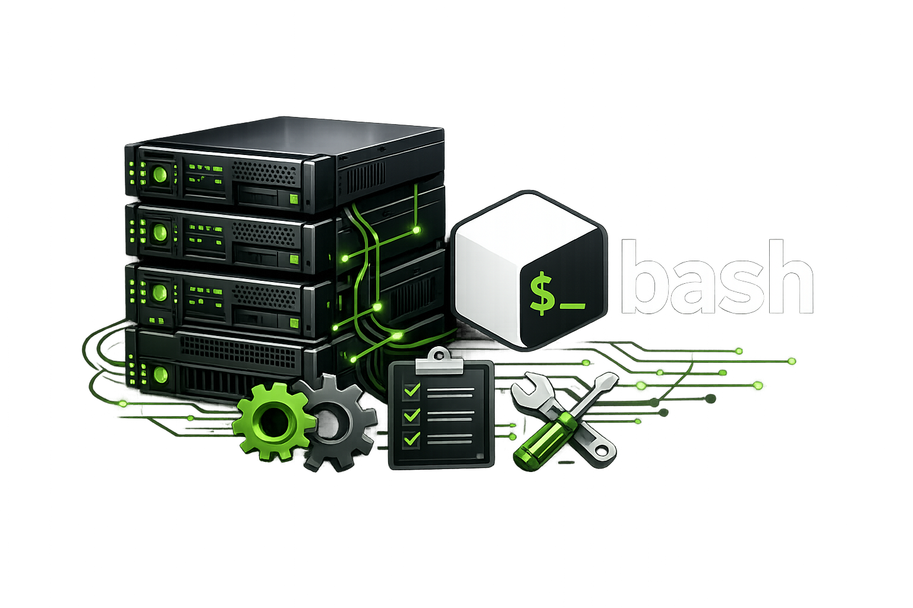

# Bash Scripts


**A collection of Bash scripts for automating deployment, provisioning, configuration, and infrastructure setup tasks on Linux servers.**


This repository is intended for system administrators, homelab operators, VPS users, and developers who want reproducible server setup workflows without relying on heavy configuration-management stacks.

---

# Features

## Automated Setup Scripts

This repository contains scripts for configuring and deploying various services and server components.

### Current Setup Targets

> This section will be filled as new scripts are added

* [BasicHardening]()
* [Certbot]()
* [SafeHardening]()
* [UfwForSMTP]()
* [Postfix&Dovecot]()

---

# Supported Systems

Tested or intended for:

* Debian
* Ubuntu

Other distributions may work but are not officially supported.

---


# Quick Start

## Clone Repository

```bash
git clone https://github.com/PeacexF/vps-setup
cd vps-setup
```
**Or clone a specific one u need**

## Make Scripts Executable

```bash
chmod +x script.sh
```

## Run Script

```bash
sudo ./script.sh
```

---

# Important Warning

## Read Before Running

These scripts may:

* Modify system configuration files
* Restart services
* Open or close firewall ports
* Change authentication settings
* Create or delete users
* Install packages and dependencies
* Alter DNS, mail, Docker, or networking configuration

Running infrastructure automation blindly on production systems is a bad idea.

Always:

* Read scripts before execution
* Test inside a VM or container first
* Keep backups of:

  * `/etc`
  * databases
  * mail data
  * Docker volumes
* Understand every command being executed
* Review generated configs manually

---

# Security Notice

These scripts are provided as-is.

You are responsible for:

* Server security
* Firewall configuration
* Patch management
* Access control
* Secrets handling
* Backup strategy
* Compliance requirements

Do not expose freshly deployed services directly to the internet without auditing configuration first.

---

# Basic Manual Server Hardening Guide

Even with automation, **manual hardening** still matters.

## 1. Update System

```bash
apt update && apt upgrade -y
```

Enable automatic security updates if appropriate.

---

## 2. Create Non-Root User

```bash
adduser username
usermod -aG sudo username
```

Disable direct root SSH login afterward.

---

## 3. Configure SSH Securely

Edit:

```bash
/etc/ssh/sshd_config
```

Recommended changes:

```text
PermitRootLogin no
PasswordAuthentication no
PubkeyAuthentication yes
```

Restart SSH:

```bash
systemctl restart ssh
```

**Use SSH keys** instead of passwords.

---

## 4. Configure Firewall

Example with UFW:

```bash
ufw default deny incoming
ufw default allow outgoing

ufw allow 22/tcp
ufw allow 80/tcp
ufw allow 443/tcp

ufw enable
```

Only expose **required** ports.

---

## 5. Install Intrusion Protection

Example:

```bash
apt install fail2ban -y
```

Enable and start:

```bash
systemctl enable fail2ban
systemctl start fail2ban
```

---

## 6. Keep Services Minimal

Remove unused software:

```bash
apt purge unused-package
```

Check listening ports:

```bash
ss -tulpn
```

Audit exposed services regularly.

---

## 7. Use Proper File Permissions

Sensitive files should never be world-readable.

Examples:

```bash
chmod 600 private.key
chmod 700 ~/.ssh
```

---

## 8. Monitor Logs

Useful locations:

```text
/var/log/auth.log
/var/log/syslog
/var/log/mail.log
```

Useful commands:

```bash
journalctl -xe
tail -f /var/log/auth.log
```

---

## 9. Backup Everything Important

Minimum backup targets:

* `/etc`
* databases
* mail directories
* Docker volumes
* application configs
* SSL certificates

Test restore procedures regularly.

---

## 10. Avoid Blind Copy-Paste Administration

Before executing commands:

* Understand what they do
* Verify sources
* Check permissions
* Review generated configs
* Validate firewall impact

Infrastructure mistakes compound quickly.

---

# Contribution

All contributions are welcome as long as they are tested.

---

# License
MIT

---

# Disclaimer

This repository is intended for educational and administrative use.

No warranty is provided for:

* data loss
* downtime
* misconfiguration
* security incidents
* provider bans
* service disruption

*Use responsibly.*
